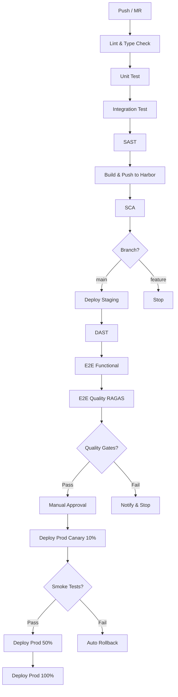

# CI/CD Pipeline Definition (GitHub Actions)

| **Версия** | 1.0 (проект) |
|------------|--------------|
| **Статус** | Готов к утверждению |
| **Дата** | 07.04.2026 |
| **Система** | RAG SOC Platform |
| **Хранение** | `rag-soc-infra/docs/cicd-pipeline-definition.md` |

***

## 1. Обзор архитектуры

### Принципы

- **Скорость важнее идеальности**: Pipeline должен завершаться ≤ 30 мин для типичного PR.
- **Безопасность по умолчанию**: SAST/SCA/DAST на каждом этапе, блокировка при критических уязвимостях.
- **Воспроизводимость**: Любой коммит → детерминированный артефакт (образ, Helm-чарт).
- **Автоматизация для 0.05 FTE**: Минимум ручных вмешательств, кроме деплоя в prod.
- **Quality Gates**: Деплой в prod только при прохождении метрик качества (RAGAS).

### Схема pipeline



### Контурность

| Этап | Окружение | Namespace K8s | Доступ |
|------|-----------|---------------|--------|
| Lint → SCA | Ephemeral (GitLab Runner) | — | CI only |
| Deploy Staging | Test | `staging` | Разработчики, ML-инженеры |
| Deploy Prod | Production | `prod` | Только через manual approval |

***

## 2. Инфраструктура CI/CD (GitHub Actions + Self-hosted runners)

### Self-hosted runners в K8s

**Компонент:** `rag-soc-github-runners` (в `rag-soc-infra`)

**Характеристики:**
- Развертывается через Helm-чарт `actions-runner-controller/actions-runner-controller`
- Namespace: `github-runners`
- Runner ScaleSet: динамическое масштабирование (0–5 подов)
- Docker-in-Docker (dind) для сборки образов
- Кэширование:
  - `pip` кэш: `/root/.cache/pip`
  - `Gradle` кэш: `/root/.gradle/caches`
  - Docker layers: через `--cache-from` в Harbor

**Ресурсы на runner-под:**
```yaml
resources:
  requests:
    cpu: 500m
    memory: 1Gi
  limits:
    cpu: 2000m
    memory: 4Gi
```

**Установка Actions Runner Controller (ARC):**
```bash
helm repo add actions-runner-controller https://actions-runner-controller.github.io/actions-runner-controller
helm install arc actions-runner-controller/actions-runner-controller \
  --namespace github-runners \
  --create-namespace \
  --set githubWebhookServer.webhookSecretToken=$WEBHOOK_SECRET
```

**Регистрация runners в GitHub:**
1. Settings → Actions → Runners → New self-hosted runner.
2. Скачать токен, создать `RunnerDeployment` в K8s.

### Кэширование

| Тип | Ключ | Путь | TTL |
|-----|------|------|-----|
| pip | `pip-${{ hashFiles('requirements.txt') }}` | `/root/.cache/pip` | 7 дней |
| Gradle | `gradle-${{ hashFiles('**/*.gradle.kts') }}` | `/root/.gradle/caches` | 7 дней |
| Docker layers | `docker-${{ github.sha }}` | — | 30 дней |
| testcontainers | `testcontainers-${{ hashFiles('**/testcontainers.properties') }}` | `/root/.testcontainers` | 7 дней |

### Артефакты

| Артефакт | Формат | Хранение | TTL |
|----------|--------|----------|-----|
| Отчёты тестов | JUnit XML | GitHub Actions | 30 дней |
| Покрытие кода | Cobertura XML | GitHub Actions | 30 дней |
| SAST отчёты | SARIF | GitHub Security Tab | 90 дней |
| SCA отчёты | JSON | GitHub Actions | 90 дней |
| DAST отчёты | HTML | GitHub Actions | 90 дней |
| RAGAS метрики | JSON | Object Storage (S3) | 1 год |
| Docker образы | OCI | Harbor | 1 год |
| Helm чарты | TGV | Harbor | 1 год |


### 2.1 Разделение раннеров по типам задач

| Тип задач | Runners | Обоснование |
|-----------|---------|-------------|
| Lint, Unit Test, SAST, SCA | GitHub-hosted (ubuntu-latest) | Экономия ресурсов self-hosted, высокая скорость, бесплатно |
| Integration Test, Build, E2E Functional, E2E Quality | Self-hosted (K8s) | Требуют доступа к внутренней сети, GPU, больших ресурсов |
| Deploy (Staging/Prod) | Self-hosted (K8s) | Требуют доступа к K8s кластеру |

***

## 3. Стадии pipeline

### Файл: .github/workflows/ci.yml (корень rag-soc-core)

```yaml
name: RAG SOC CI/CD

on:
  push:
    branches: [main]
  pull_request:
    branches: [main]

env:
  PIP_CACHE_DIR: ${{ github.workspace }}/.cache/pip
  DOCKER_REGISTRY: harbor.rag-soc.internal/rag-soc
  IMAGE_TAG: ${{ github.sha }}

jobs:
  # ==================== LINT ====================
  lint-ruff:
    runs-on: ubuntu-latest
    steps:
      - uses: actions/checkout@v4
      
      - name: Set up Python
        uses: actions/setup-python@v5
        with:
          python-version: '3.11'
          cache: 'pip'
      
      - name: Install ruff
        run: pip install ruff
      
      - name: Run ruff
        run: |
          ruff check services/ common/ --output-format=github > gl-lint-report.json
          ruff format services/ common/ --check
      
      - name: Upload lint report
        if: always()
        uses: actions/upload-artifact@v4
        with:
          name: lint-report
          path: gl-lint-report.json

  lint-mypy:
    runs-on: ubuntu-latest
    steps:
      - uses: actions/checkout@v4
      
      - name: Set up Python
        uses: actions/setup-python@v5
        with:
          python-version: '3.11'
          cache: 'pip'
      
      - name: Install mypy
        run: pip install mypy types-requests types-PyYAML
      
      - name: Run mypy
        run: mypy services/ common/ --strict --pretty

  # ==================== UNIT TEST ====================
  test-unit:
    runs-on: ubuntu-latest
    steps:
      - uses: actions/checkout@v4
      
      - name: Set up Python
        uses: actions/setup-python@v5
        with:
          python-version: '3.11'
          cache: 'pip'
      
      - name: Install dependencies
        run: pip install -r requirements-dev.txt
      
      - name: Run unit tests
        run: |
          pytest services/*/tests/unit/ \
            --cov=. \
            --cov-report=xml \
            --cov-fail-under=50 \
            --junitxml=unit-report.xml
      
      - name: Upload coverage
        uses: actions/upload-artifact@v4
        with:
          name: coverage-report
          path: coverage.xml
      
      - name: Upload test report
        if: always()
        uses: actions/upload-artifact@v4
        with:
          name: unit-test-report
          path: unit-report.xml

  # ==================== INTEGRATION TEST ====================
  test-integration:
    runs-on: self-hosted
    services:
      postgres:
        image: postgres:15-alpine
        env:
          POSTGRES_DB: test_db
          POSTGRES_USER: test_user
          POSTGRES_PASSWORD: test_pass
        ports:
          - 5432:5432
        options: >-
          --health-cmd pg_isready
          --health-interval 10s
          --health-timeout 5s
          --health-retries 5
      redis:
        image: redis:7-alpine
        ports:
          - 6379:6379
      qdrant:
        image: qdrant/qdrant:latest
        ports:
          - 6333:6333
    steps:
      - uses: actions/checkout@v4
      
      - name: Set up Python
        uses: actions/setup-python@v5
        with:
          python-version: '3.11'
          cache: 'pip'
      
      - name: Install dependencies
        run: pip install -r requirements-dev.txt
      
      - name: Run integration tests
        run: pytest services/*/tests/integration/ --junitxml=integration-report.xml
      
      - name: Upload test report
        if: always()
        uses: actions/upload-artifact@v4
        with:
          name: integration-test-report
          path: integration-report.xml

  # ==================== SAST ====================
  security-sast:
    runs-on: ubuntu-latest
    steps:
      - uses: actions/checkout@v4
      
      - name: Run Semgrep
        uses: returntocorp/semgrep-action@v1
        with:
          config: auto
          output: gl-sast-report.json
      
      - name: Upload SAST report
        if: always()
        uses: actions/upload-artifact@v4
        with:
          name: sast-report
          path: gl-sast-report.json

  # ==================== BUILD ====================
  build:
    runs-on: self-hosted
    needs: [lint-ruff, lint-mypy, test-unit, test-integration, security-sast]
    if: github.ref == 'refs/heads/main'
    steps:
      - uses: actions/checkout@v4
      
      - name: Log in to Harbor
        uses: docker/login-action@v3
        with:
          registry: ${{ env.DOCKER_REGISTRY }}
          username: ${{ secrets.HARBOR_USER }}
          password: ${{ secrets.HARBOR_PASSWORD }}
      
      - name: Build and push images
        run: |
          for service in services/*/; do
            SERVICE_NAME=$(basename $service)
            docker build --cache-from ${{ env.DOCKER_REGISTRY }}/$SERVICE_NAME:latest \
              -t ${{ env.DOCKER_REGISTRY }}/$SERVICE_NAME:${{ env.IMAGE_TAG }} \
              $service
            docker push ${{ env.DOCKER_REGISTRY }}/$SERVICE_NAME:${{ env.IMAGE_TAG }}
            docker tag ${{ env.DOCKER_REGISTRY }}/$SERVICE_NAME:${{ env.IMAGE_TAG }} \
              ${{ env.DOCKER_REGISTRY }}/$SERVICE_NAME:latest
            docker push ${{ env.DOCKER_REGISTRY }}/$SERVICE_NAME:latest
          done

  # ==================== SCA ====================
  security-sca:
    runs-on: ubuntu-latest
    steps:
      - uses: actions/checkout@v4
      
      - name: Set up Python
        uses: actions/setup-python@v5
        with:
          python-version: '3.11'
          cache: 'pip'
      
      - name: Install pip-audit
        run: pip install pip-audit
      
      - name: Run SCA
        run: pip-audit --requirement requirements.txt --severity high --output=gl-sca-report.json
      
      - name: Upload SCA report
        if: always()
        uses: actions/upload-artifact@v4
        with:
          name: sca-report
          path: gl-sca-report.json

  # ==================== DEPLOY STAGING ====================
  deploy-staging:
    runs-on: self-hosted
    needs: [build, security-sca]
    environment: staging
    steps:
      - uses: actions/checkout@v4
      
      - name: Set up Helm
        uses: azure/setup-helm@v3
        with:
          version: v3.12.0
      
      - name: Configure kubectl
        uses: azure/k8s-set-context@v3
        with:
          method: kubeconfig
          kubeconfig: ${{ secrets.KUBECONFIG_STAGING }}
      
      - name: Deploy to staging
        run: |
          for service in services/*/; do
            SERVICE_NAME=$(basename $service)
            helm upgrade --install rag-soc-$SERVICE_NAME ./deployments/rag-soc-core \
              --namespace staging \
              --set image.tag=${{ env.IMAGE_TAG }} \
              --set image.repository=${{ env.DOCKER_REGISTRY }}/$SERVICE_NAME \
              --values deployments/rag-soc-core/values/staging.yaml \
              --wait --timeout 5m
          done

  # ==================== DAST ====================
  validate-dast:
    runs-on: ubuntu-latest
    needs: [deploy-staging]
    steps:
      - uses: actions/checkout@v4
      
      - name: Run OWASP ZAP
        uses: zaproxy/action-api-scan@v1
        with:
          target: https://staging.rag-soc.internal/api/v1/openapi.json
          output: gl-dast-report.html
      
      - name: Upload DAST report
        if: always()
        uses: actions/upload-artifact@v4
        with:
          name: dast-report
          path: gl-dast-report.html

  # ==================== E2E FUNCTIONAL TEST ====================
  validate-e2e-functional:
    runs-on: self-hosted
    needs: [deploy-staging]
    steps:
      - uses: actions/checkout@v4
      
      - name: Set up Python
        uses: actions/setup-python@v5
        with:
          python-version: '3.11'
          cache: 'pip'
      
      - name: Install dependencies
        run: pip install -r requirements-dev.txt
      
      - name: Run E2E functional tests
        run: pytest tests/e2e/functional/ --env=staging --junitxml=e2e-functional-report.xml
      
      - name: Upload test report
        if: always()
        uses: actions/upload-artifact@v4
        with:
          name: e2e-functional-report
          path: e2e-functional-report.xml

  # ==================== E2E QUALITY TEST (RAGAS) ====================
  validate-e2e-quality:
    runs-on: self-hosted
    needs: [deploy-staging]
    steps:
      - uses: actions/checkout@v4
      
      - name: Set up Python
        uses: actions/setup-python@v5
        with:
          python-version: '3.11'
          cache: 'pip'
      
      - name: Install dependencies
        run: pip install -r requirements-dev.txt ragas
      
      - name: Run E2E quality tests
        run: |
          pytest tests/e2e/quality/ \
            --env=staging \
            --ragas-metrics=faithfulness,answer_correctness \
            --junitxml=e2e-quality-report.xml
          python scripts/extract_ragas_metrics.py e2e-quality-report.xml > ragas-metrics.json
      
      - name: Check quality gates
        run: |
          python scripts/check_quality_gates.py ragas-metrics.json
      
      - name: Upload quality report
        if: always()
        uses: actions/upload-artifact@v4
        with:
          name: e2e-quality-report
          path: |
            e2e-quality-report.xml
            ragas-metrics.json

  # ==================== DEPLOY PROD ====================
  deploy-prod:
    runs-on: self-hosted
    needs: [validate-dast, validate-e2e-functional, validate-e2e-quality]
    environment: production
    if: github.ref == 'refs/heads/main'
    steps:
      - uses: actions/checkout@v4
      
      - name: Set up Helm
        uses: azure/setup-helm@v3
        with:
          version: v3.12.0
      
      - name: Configure kubectl
        uses: azure/k8s-set-context@v3
        with:
          method: kubeconfig
          kubeconfig: ${{ secrets.KUBECONFIG_PROD }}
      
      - name: Canary deploy 10%
        run: |
          for service in services/*/; do
            SERVICE_NAME=$(basename $service)
            helm upgrade --install rag-soc-$SERVICE_NAME ./deployments/rag-soc-core \
              --namespace prod \
              --set image.tag=${{ env.IMAGE_TAG }} \
              --set image.repository=${{ env.DOCKER_REGISTRY }}/$SERVICE_NAME \
              --set replicaCount=1 \
              --set canary.weight=10 \
              --values deployments/rag-soc-core/values/prod.yaml \
              --wait --timeout 5m
          done
      
      - name: Wait for canary
        run: sleep 60
      
      - name: Smoke tests (canary)
        run: python tests/smoke/prod_smoke_tests.py --env=prod --canary
      
      - name: Rollout 50%
        run: |
          for service in services/*/; do
            SERVICE_NAME=$(basename $service)
            helm upgrade rag-soc-$SERVICE_NAME ./deployments/rag-soc-core \
              --namespace prod \
              --set canary.weight=50 \
              --wait --timeout 5m
          done
      
      - name: Wait for 50%
        run: sleep 60
      
      - name: Smoke tests (50%)
        run: python tests/smoke/prod_smoke_tests.py --env=prod --rollout-50
      
      - name: Rollout 100%
        run: |
          for service in services/*/; do
            SERVICE_NAME=$(basename $service)
            helm upgrade rag-soc-$SERVICE_NAME ./deployments/rag-soc-core \
              --namespace prod \
              --set canary.weight=100 \
              --wait --timeout 5m
          done
```

***

## 4. Quality Gates

| Gate | Порог | Действие | Stage блокировки |
|------|-------|----------|------------------|
| Unit test coverage | ≥ 50% | Блокировка merge request | `unit-test` |
| SAST (critical) | 0 | Блокировка merge request | `sast` |
| SCA (critical) | 0 | Блокировка merge request | `sca` |
| DAST (High/Critical) | 0 | Блокировка деплоя в prod | `dast` |
| E2E Functional | Все тесты passed | Блокировка деплоя в prod | `e2e-test` |
| E2E Quality (faithfulness) | ≥ 0.8 | Блокировка деплоя в prod | `quality-test` |
| E2E Quality (answer correctness) | ≥ 0.75 | Блокировка деплоя в prod | `quality-test` |
| E2E Quality (context precision) | ≥ 0.7 | Warning | `quality-test` |

***

## 5. Стратегии деплоя

### Staging

- **Триггер:** Автоматический при merge в `main`.
- **Метод:** Rolling update (стандартный K8s).
- **Откат:** Автоматический при провале стадий `dast`, `e2e-test`, или `quality-test`.

### Production

- **Триггер:** Manual approval (требует роли `maintainer` в GitHub, настраивается в Environment Protection Rules).
- **Метод:** Canary через Istio Traffic Management:
  1. **10% трафика** → smoke tests → ожидание 5 мин.
  2. **50% трафика** → smoke tests → ожидание 10 мин.
  3. **100% трафика** → финальные smoke tests.
- **Откат:** Автоматический при:
  - Error rate > 5% в течение 5 мин.
  - Latency p95 > 60 сек в течение 5 мин.
  - Провале smoke tests.
  - Падении RAGAS метрик в canary (faithfulness < 0.7 или answer correctness < 0.65)

**Механизм автоматического отката:**
```yaml
# Prometheus AlertRule
- alert: CanaryQualityDegradation
  expr: |
    (ragas_faithfulness{version="canary"} < 0.7) or
    (ragas_answer_correctness{version="canary"} < 0.65)
  annotations:
    action: "kubectl patch virtualservice rag-soc-orchestrator -n prod --type='json' -p='[{\"op\": \"replace\", \"path\": \"/spec/http/0/route/0/weight\", \"value\": 0}]'"
```

### Canary-конфигурация (Istio VirtualService)

```yaml
apiVersion: networking.istio.io/v1beta1
kind: VirtualService
metadata:
  name: rag-soc-orchestrator
  namespace: prod
spec:
  hosts:
    - rag-soc-orchestrator
  http:
    - route:
        - destination:
            host: rag-soc-orchestrator
            subset: canary
          weight: 10
        - destination:
            host: rag-soc-orchestrator
            subset: stable
          weight: 90
```

***

## 6. Интеграции

### Harbor

- **URL:** `harbor.rag-soc.internal`
- **Проект:** `rag-soc`
- **Сканирование уязвимостей:** Автоматическое при push образа.
- **Retention policy:** Хранить последние 10 тегов + `latest`.

**Интеграция в pipeline:**
```yaml
- name: Log in to Harbor
  uses: docker/login-action@v3
  with:
    registry: ${{ env.DOCKER_REGISTRY }}
    username: ${{ secrets.HARBOR_USER }}
    password: ${{ secrets.HARBOR_PASSWORD }}
```

### Kubernetes

- **Namespaces:** `staging`, `prod`, `github-runners`.
- **ServiceAccount:** `github-runner` с ClusterRole `edit` в `staging` и `prod`.
- **Kubeconfig:** Хранится в GitHub Secrets (`KUBECONFIG_STAGING`, `KUBECONFIG_PROD`), masked + protected.
- **OIDC (опционально):** Настройка trust policy в K8s для деплоя без kubeconfig (требуется IRSA или аналог).

### Prometheus

- **Метрики pipeline:**
  - Собираются через GitHub Actions API (external exporter).
  - `github_actions_job_duration_seconds`
  - `github_actions_job_status` (success/failed)
  - `github_actions_workflow_run_duration_seconds`

**Дашборд Grafana:** `GitHub Actions CI/CD Analytics` (кастомный).

### Уведомления

| Событие | Канал | Получатели |
|---------|-------|------------|
| Failed pipeline (main) | Slack (GitHub App) | Вся команда |
| Failed deploy (prod) | Slack + Email + SMS | DevOps + Team Lead |
| Quality Gate failed | Slack | ML-инженеры + Разработчики |
| Security finding (critical) | Slack + Email | Security Engineer + DevOps |

***

## 7. Конфигурация и секреты


### GitHub Secrets

| Переменная | Scope | Masked | Protected | Описание |
|------------|-------|--------|-----------|----------|
| `HARBOR_USER` | Repository | ✅ | ✅ | Пользователь Harbor |
| `HARBOR_PASSWORD` | Repository | ✅ | ✅ | Пароль Harbor |
| `KUBECONFIG_STAGING` | Repository | ✅ | ✅ | Kubeconfig для staging |
| `KUBECONFIG_PROD` | Repository | ✅ | ✅ | Kubeconfig для prod |
| `RAGAS_FAITHFULNESS_THRESHOLD` | Repository | ❌ | ❌ | Порог faithfulness (0.8) |
| `RAGAS_CORRECTNESS_THRESHOLD` | Repository | ❌ | ❌ | Порог answer correctness (0.75) |
| `KUBERNETES_OIDC_PROVIDER` | Repository | ❌ | ❌ | OIDC провайдер для K8s (например, https://kubernetes.default.svc) |

### OIDC интеграция с K8s (рекомендовано вместо kubeconfig)

**Настройка доверия в K8s:**
```yaml
apiVersion: rbac.authorization.k8s.io/v1
kind: RoleBinding
metadata:
  name: github-actions-oidc
  namespace: staging
subjects:
  - kind: ServiceAccount
    name: github-runner
    namespace: github-runners
roleRef:
  kind: Role
  name: deployer
  apiGroup: rbac.authorization.k8s.io
```
 
**Использование в pipeline:**
```yaml
- name: Configure kubectl with OIDC
  uses: azure/k8s-set-context@v3
  with:
    method: oidc
    oidc-provider: ${{ secrets.KUBERNETES_OIDC_PROVIDER }}
    oidc-client-id: ${{ secrets.OIDC_CLIENT_ID }}
```

### Environment Protection Rules (GitHub)

| Environment | Required reviewers | Wait timer | Deployment branches |
|-------------|-------------------|------------|---------------------|
| `staging` | None | 0 мин | `main` only |
| `production` | 1–2 maintainers | 0 мин | `main` only |

**Настройка:** Settings → Environments → New environment.

***

## 8. Мониторинг pipeline

### Метрики

| Метрика | Тип | Порог алерта |
|---------|-----|--------------|
| Pipeline duration (p95) | Histogram | > 30 мин |
| Pipeline success rate (1h) | Gauge | < 90% |
| Flaky tests count | Counter | > 3 за неделю |
| Security findings (critical) | Counter | > 0 |
| Deploy frequency | Counter | < 1 в день (warning) |

**Источник:** GitHub Actions API + кастомный exporter для Prometheus.

### Алерты (Prometheus AlertManager)

```yaml
groups:
  - name: github-actions
    rules:
      - alert: GitHubActionsWorkflowFailed
        expr: github_actions_job_status{branch="main", result="failure"} == 1
        for: 0m
        labels:
          severity: warning
        annotations:
          summary: "Workflow failed on main"
          
      - alert: GitHubActionsWorkflowSlow
        expr: histogram_quantile(0.95, rate(github_actions_workflow_run_duration_seconds_bucket[1h])) > 1800
        for: 30m
        labels:
          severity: warning
        annotations:
          summary: "Workflow p95 duration > 30 min"
```

### Дашборд

**Grafana Dashboard:** `RAG SOC CI/CD Overview`

**Панели:**
1. Workflow success rate (24h, 7d).
2. Average workflow duration (trend).
3. Top 5 slowest jobs.
4. Security findings trend (SAST/SCA/DAST).
5. RAGAS metrics trend (faithfulness, correctness).
6. Deploy frequency (per day).

***

## 9. Disaster Recovery

### Backup GitHub Secrets и Settings

**Компоненты:**
- GitHub Secrets — экспорт через GitHub CLI (`gh secret list --json`).
- Environment Protection Rules — документировать в `rag-soc-infra/docs/github-settings.md`.
- Self-hosted runners — Helm-чарт `actions-runner-controller` в `rag-soc-infra`.

**RPO:** 24 часа (ручной экспорт secrets).  
**RTO:** 2 часа (восстановление runners + secrets).

### Восстановление runners

1. Удалить зависшие поды в `github-runners`.
2. Пересоздать Helm-релиз `arc` (actions-runner-controller).
3. Проверить регистрацию в GitHub Settings → Actions → Runners.

### Fallback на GitHub-hosted runners

**Триггер:** Self-hosted runners недоступны > 1 часа.

**Процедура:**
1. Временно переключить jobs с `runs-on: self-hosted` на `runs-on: ubuntu-latest`.
2. Использовать GitHub-hosted runners для всех stages (кроме build/deploy из-за доступа к K8s).
3. Для build/deploy — временно использовать `kubectl` с kubeconfig из Secrets.

**Ограничения:** Лимит 2000 мин/мес, нет доступа к внутреннему K8s без tuneлей.

***

## 10. Приложение: Полный код `.github/workflows/ci.yml`

См. раздел 3.

---

| **Версия** | **Дата**   | **Автор** | **Изменения**                                               |
|------------|------------| --------- |-------------------------------------------------------------|
| 1.0        | 07.04.2026 | Точенов   | Первая версия                                               |
---