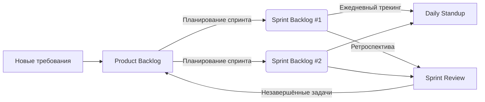

# Product Backlog — RAG SOC Platform

> Обновлён: 2026-04-05 | Владелец: RAG SOC Platform Team

## 🔝 Готово к спринту (Top 10-15)

| ID     | Задача                                                                                                          | Приоритет | Оценка (SP) | Эпик   |
|--------|-----------------------------------------------------------------------------------------------------------------|-----------|-------------|--------|
| PB-001 | Подготовить описание интерфейсов (Swagger) для MVP API Gateway                                                  | Must      | 2           | MANAGE |
| PB-002 | Подготовить диаграмму компонентов API Gateway (в объеме MVP)                                                    | Must      | 5           | MANAGE |
| PB-003 | Реализовать интерфейсы REST API Gateway, относящиеся к Convetrter                                               | Must      | 3           | MANAGE |
| PB-004 | Реализовать интерфейсы REST API Gateway, относящиеся к Experimentation Service                                  | Must      | 3           | MANAGE |
| PB-005 | Реализовать интерфейсы REST API Gateway, относящиеся к Indexer                                                  | Must      | 3           | MANAGE |
| PB-006 | Реализовать прямую маршрутизацию запросов API Gateway (без учета Istio)                                         | Must      | 5           | MANAGE |
| PB-007 | Реализовать многоуровневое логирование API Gateway через Kafka                                                  | Must      | 5           | MANAGE |
| PB-008 | Реализовать трассировку API Gateway                                                                             | Must      | 5           | MANAGE |
| PB-009 | Реализовать мониторинг метрик API Gateway                                                                       | Must      | 5           | MANAGE |
| PB-010 | Подготовить Dockerfile для запуска API Gateway в Kubernetes                                                     | Must      | 3           | MANAGE |
| PB-011 | Реализовать страницу Web-портала администраторов, обеспечивающую аутентификацию пользователя через IdP          | Must      | 5           | SEC    |
| PB-012 | Реализовать аутентификацию пользователя через IdP и авторизацию запросов в API Gateway                          | Must      | 13          | SEC    |
| PB-013 | Реализовать многоуровневое логирование Converter через Kafka                                                    | Must      | 5           | BASE   |
| PB-014 | Реализовать трассировку Converter                                                                               | Must      | 5           | BASE   |
| PB-015 | Реализовать мониторинг метрик Converter                                                                         | Must      | 5           | BASE   |
| PB-016 | Реализовать модульные тесты (Unit, Integration) для Converter                                                   | Must      | 8           | BASE   |
| PB-017 | Подготовить описание интерфейсов (Swagger) для Indexer                                                          | Must      | 2           | BASE   |
| PB-018 | Подготовить диаграмму компонентов Indexer                                                                       | Must      | 5           | BASE   |
| PB-019 | Реализовать интерфейсы REST API Indexer                                                                         | Must      | 3           | BASE   |
| PB-020 | Реализовать многоуровневое логирование Indexer через Kafka                                                      | Must      | 5           | BASE   |
| PB-021 | Реализовать трассировку Indexer                                                                                 | Must      | 5           | BASE   |
| PB-022 | Реализовать мониторинг метрик Converter                                                                         | Must      | 5           | BASE   |
| PB-023 | Реализовать модульные тесты (Unit, Integration) для Indexer                                                     | Must      | 8           | BASE   |
| PB-024 | Подготовить Dockerfile для запуска Indexer в Kubernetes                                                         | Must      | 2           | BASE   |
| PB-025 | Подготовить диаграмму компонентов RAG Orchestrator                                                              | Must      | 8           | MANAGE  |
| PB-026 | Подготовить описание интерфейсов (Swagger) для RAG Orchestrator                                                 | Must      | 5           | MANAGE  |
| PB-027 | Реализовать интерфейсы REST API RAG Orchestrator                                                                | Must      | 5           | MANAGE  |
| PB-028 | Подготовить Dockerfile для запуска RAG Orchestrator в Kubernetes                                                | Must      | 3           | MANAGE  |
| PB-029 | Подготовить описание интерфейсов (Swagger) для Experimentation Service                                          | Must      | 2           | EXP    |
| PB-030 | Подготовить Use Cases для Experimentation Service                                                               | Must      | 3           | EXP    |
| PB-031 | Подготовить диаграмму компонентов Experimentation Service                                                       | Must      | 8           | EXP    |
| PB-032 | Реализовать интерфейсы REST API Experimentation Service                                                         | Must      | 3           | EXP    |
| PB-033 | Реализовать многоуровневое логирование Experimentation Service через Kafka                                      | Must      | 5           | EXP    |
| PB-034 | Реализовать трассировку Experimentation Service                                                                 | Must      | 5           | EXP    |
| PB-035 | Реализовать мониторинг метрик Experimentation Service                                                           | Must      | 5           | EXP    |
| PB-036 | Подготовить Dockerfile для запуска Experimentation Service в Kubernetes                                         | Must      | 3           | EXP    |
| PB-037 | Поднять тестовый контур, дать к нему доступ из Интернет для администрирования                                   | Must      | 5           | INFRA  |
| PB-038 | Поднять внешние сервисы (MiniO, Keycloak, Container Registry, Monitoring Stack, Docker, Kubernetes, Helm)       | Must      | 13          | INFRA  |
| PB-039 | Поднять внутренние сервисы тестового контура в Kubernetes (Chroma, Elasticsearch, S3, Kafka, PostgreSQL, Istio) | Must      | 13          | INFRA  |
| PB-040 | Поднять сервисы безопасности (SCA, SAST, SCA Containers, DAST)                                                  | Must      | 8           | SEC    |
| PB-041 | Настройка b проверка конвейера CI/CD                                                                            | Must      | 20          | INFRA  |

## 🗂️ Бэклог по категориям

### Функциональные требования
- PB-001 ... PB-041

### Технические задачи
- PB-043 Принять решение - Внутренний вызов между сервисами Experimentation Service → RAG Orchestrator является исключением и **не проходит через API Gateway** (решение требует подтверждения, единственное исключение не ласт значительного выигрыша в производительности, но усложняет реализацию).
- PB-044 Принять решение - Разграничение зон ответственности между RAG Orchestrator, API Gateway, Istio, Ingress и закрепление их в документации.


### Баги
- PB-042 Обнаружено, что при конвертации документов html -> json теряется часть текста

## 📦 Эпики

### EPIC-MANAGE: Управление системой
- PB-001 - PB-010

### EPIC-BASE: Базовые сервисы RAG (конвертирование, индексирование, генерация)
- PB-013 - PB-024

### EPIC-EXP: Возможность проведения экспериментов
- PB-029 - PB-036

### EPIC-SEC: Безопасность системы
- PB-011, PB-012, PB-040

### EPIC-INFRA: Инфраструктура
- PB-037 - PB-039, PB-041


## ❄️ Icebox (идеи на будущее)
- [ ] Обработка с использованиемм ИИ картинок из состава документации

***

## 📎 Приложение A: Процесс работы с бэклогом

### 🔄 Визуальная схема процесса



***

### 📋 Пошаговый цикл работы

| Шаг | Действие | Где фиксируется | Кто отвечает | Частота |
|-----|----------|-----------------|--------------|---------|
| **1** | **Накопление требований** — новые фичи, баги, техдолг добавляются в конец бэклога | `Product_backlog.md` (секция «Бэклог по категориям») | Product Owner / Все участники | Постоянно |
| **2** | **Приоритизация** — топ-15 задач поднимаются вверх, уточняются критерии приемки и оценки | `Product_backlog.md` (секция «Готово к спринту») | Product Owner | Перед каждым планированием |
| **3** | **Планирование спринта** — команда забирает 5-10 задач из топа в новый спринт | `sprint-XX/Sprint_backlog.md` (новый файл) | Команда + PO | Начало спринта |
| **4** | **Декомпозиция** — крупные задачи дробятся на технические подзадачи (если нужно) | `sprint-XX/Sprint_backlog.md` (детализация задач) | Разработчики | Первые 1-2 дня спринта |
| **5** | **Ежедневный трекинг** — обновление статусов, фиксация прогресса и блокеров | `sprint-XX/Sprint_backlog.md` (секция «Daily-трекинг») | Вся команда | Ежедневно (15 мин) |
| **6** | **Завершение спринта** — готовые задачи закрываются, незавершённые возвращаются в Product Backlog | `sprint-XX/Sprint_review.md` + `PRODUCT_BACKLOG.md` | Команда + PO | Конец спринта |
| **7** | **Ретроспектива** — итоги спринта, извлечённые уроки, план улучшений | `sprint-XX/Sprint_review.md` | Вся команда | Конец спринта |
| **8** | **Повтор** — переход к следующему спринту | — | — | Циклично |

***

### 📏 Правила и ограничения

```markdown
> **Правило 80%** — не планируйте более 80% ёмкости команды (остальное — буфер на неопределённость)  
> **Правило 1/3** — ни одна задача не должна занимать больше 1/3 длительности спринта  
> **Правило заморозки** — после старта спринта изменения в Sprint Backlog минимальны (только критичные баги)  
> **Правило трассировки** — каждая задача спринта должна иметь ссылку на источник в Product Backlog (SB-XXX ← PB-YYY)
```

***

### 🚦 Статусы задач

| Статус          | Обозначение | Описание                                             |
|-----------------|------------|------------------------------------------------------|
| **Todo**        | ⚪          | Задача готова к работе, не начата                    |
| **In Progress** | 🟡         | В работе (указать % готовности в Daily)              |
| **Blocked**     | 🔴         | Есть блокер (обязательно описать в секции «Блокеры») |
| **Done**        | 🟢         | Критерии приемки выполнены, PR принят                |
| **Returned**    | 🔄         | Не завершена в спринте, возвращена в Product Backlog |

***

### 📁 Шаблон именования файлов

```
docs/
├── 21.Product_backlog.md
├── sprint-01/
│   ├── Sprint_backlog.md
│   └── Sprint_review.md
├── sprint-02/
│   ├── Sprint_backlog.md
│   └── Sprint_review.md
└── ...
```

**Спринты нумеруются последовательно**: `sprint-01`, `sprint-02`, `sprint-03`...  
**Даты в заголовке**: `Спринт #07 (2026-04-07 — 2026-04-18)`

***

## 📎 Приложение B: Оценка (SP)

Story Points (очки истории) - относительная единица оценки сложности задачи в Agile/Scrum, а не время в часах.

🎯 Что оценивают в Story Points
SP отражают три фактора одновременно:

| Фактор                 | Что означает                       | Пример                                               |
| ---------------------- | ---------------------------------- | ---------------------------------------------------- |
| Сложность              | Насколько трудна задача технически | Интеграция с внешним API сложнее CRUD-операции       |
| Объём работы           | Сколько кода/тестов нужно написать | 1 эндпоинт vs 10 эндпоинтов                          |
| Неопределённость/риски | Насколько понятны требования       | Чёткое ТЗ vs «сделаем что-то похожее на конкурентов» |

📊 Шкала оценки (Фибоначчи)
Команды обычно используют модифицированную последовательность Фибоначчи:

| SP  | T-Shirt Size | Что означает                                       | Пример задачи                            |
| --- | ------------ | -------------------------------------------------- | ---------------------------------------- |
| 1   | XS           | Очень маленькая, почти нет рисков, 1–2 часа работы | Поправить текст в ошибке, добавить лог   |
| 2   | S            | Простая задача, минимальное тестирование           | Добавить новый фильтр в список           |
| 3   | S            | Небольшая задача, понятная реализация              | Создать простой API-эндпоинт (CRUD)      |
| 5   | M            | Средняя задача, требует тестирования и проверки    | JWT-авторизация (login + token)          |
| 8   | L            | Сложная задача, несколько сценариев, есть риски    | Интеграция с платёжным шлюзом            |
| 13  | L            | Очень сложная, много работы и тестирования         | Миграция БД с сохранением данных         |
| 20  | XL           | Слишком большая для одного спринта                 | Нужно декомпозировать!                   |
| >20 | XXL          | Критически большая                                 | Обязательно разбить на несколько историй |
