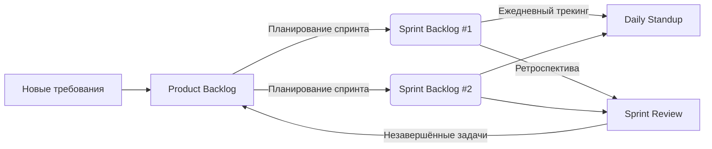

# Product Backlog — RAG SOC Platform

> Обновлён: 2026-04-05 | Владелец: RAG SOC Platform Team

## 🔝 Готово к спринту (Top 10-15)

| ID | Задача | Приоритет | Оценка (SP) | Эпик |
|----|--------|-----------|-------------|------|
| PB-042 | Реализовать JWT-авторизацию | Must | 8 | AUTH |
| PB-043 | Настроить rate limiting | Must | 5 | SECURITY |

## 🗂️ Бэклог по категориям

### Функциональные требования
- PB-001 ... PB-041

### Технические задачи
- PB-001 Принять решение - Внутренний вызов между сервисами Experimentation Service → RAG Orchestrator является исключением и **не проходит через API Gateway** (решение требует подтверждения, единственное исключение не ласт значительного выигрыша в производительности, но усложняет реализацию).

### Баги
- PB-033 ...

## 📦 Эпики

### EPIC-AUTH: Система аутентификации
- PB-042, PB-045, PB-048

## ❄️ Icebox (идеи на будущее)
- [ ] Интеграция с SSO

Вот готовый блок для вставки в ваш `backlog.md` (например, как **Приложение A: Процесс работы**):

***

## 📎 Приложение A: Процесс работы с бэклогом

### 🔄 Визуальная схема процесса



***

### 📋 Пошаговый цикл работы

| Шаг | Действие | Где фиксируется | Кто отвечает | Частота |
|-----|----------|-----------------|--------------|---------|
| **1** | **Накопление требований** — новые фичи, баги, техдолг добавляются в конец бэклога | `Product_backlog.md` (секция «Бэклог по категориям») | Product Owner / Все участники | Постоянно |
| **2** | **Приоритизация** — топ-15 задач поднимаются вверх, уточняются критерии приемки и оценки | `Product_backlog.md` (секция «Готово к спринту») | Product Owner | Перед каждым планированием |
| **3** | **Планирование спринта** — команда забирает 5-10 задач из топа в новый спринт | `sprint-XX/Sprint_backlog.md` (новый файл) | Команда + PO | Начало спринта |
| **4** | **Декомпозиция** — крупные задачи дробятся на технические подзадачи (если нужно) | `sprint-XX/Sprint_backlog.md` (детализация задач) | Разработчики | Первые 1-2 дня спринта |
| **5** | **Ежедневный трекинг** — обновление статусов, фиксация прогресса и блокеров | `sprint-XX/Sprint_backlog.md` (секция «Daily-трекинг») | Вся команда | Ежедневно (15 мин) |
| **6** | **Завершение спринта** — готовые задачи закрываются, незавершённые возвращаются в Product Backlog | `sprint-XX/Sprint_review.md` + `PRODUCT_BACKLOG.md` | Команда + PO | Конец спринта |
| **7** | **Ретроспектива** — итоги спринта, извлечённые уроки, план улучшений | `sprint-XX/Sprint_review.md` | Вся команда | Конец спринта |
| **8** | **Повтор** — переход к следующему спринту | — | — | Циклично |

***

### 📏 Правила и ограничения

```markdown
> **Правило 80%** — не планируйте более 80% ёмкости команды (остальное — буфер на неопределённость)  
> **Правило 1/3** — ни одна задача не должна занимать больше 1/3 длительности спринта  
> **Правило заморозки** — после старта спринта изменения в Sprint Backlog минимальны (только критичные баги)  
> **Правило трассировки** — каждая задача спринта должна иметь ссылку на источник в Product Backlog (SB-XXX ← PB-YYY)
```

***

### 🚦 Статусы задач

| Статус | Обозначение | Описание |
|--------|-------------|----------|
| **Todo** | ⚪ | Задача готова к работе, не начата |
| **In Progress** | 🟡 | В работе (указать % готовности в Daily) |
| **Blocked** | 🔴 | Есть блокер (обязательно описать в секции «Блокеры») |
| **Done** | 🟢 | Критерии приемки выполнены, PR принят |
| **Returned** | 🔄 | Не завершена в спринте, возвращена в Product Backlog |

***

### 📁 Шаблон именования файлов

```
docs/
├── 21.Product_backlog.md
├── sprint-01/
│   ├── Sprint_backlog.md
│   └── Sprint_review.md
├── sprint-02/
│   ├── Sprint_backlog.md
│   └── Sprint_review.md
└── ...
```

**Спринты нумеруются последовательно**: `sprint-01`, `sprint-02`, `sprint-03`...  
**Даты в заголовке**: `Спринт #07 (2026-04-07 — 2026-04-18)`

