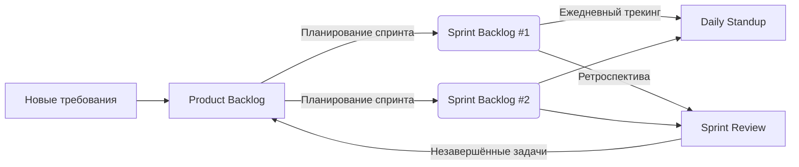

# Product Backlog — RAG SOC Platform

> Обновлён: 2026-04-08 | Владелец: RAG SOC Platform Team

## 🔝 Готово к спринту (Top 15-20)

| ID     | Задача                                                                                                          | Приоритет | Оценка (SP) | Статус | Эпик | Спринт |
|--------|-----------------------------------------------------------------------------------------------------------------|-----------|-------------|--------|------|--------|
| PB-001 | Интерфейсы для MVP API Gateway: Convetrter, Indexer, Experimentation Service (swagger, реализация, docker)      | Must      | 8           | 🟡     | -    | #001   |
| PB-002 | Диаграммы компонентов для MVP (API Gateway, Convetrter, Indexer, Experimentation Service, RAG Orchestrator)     | Should    | 8           | ⚪      | -    |        |
| PB-003 | Маршрутизация запросов API Gateway для MVP (без учета Istio)                                                    | Must      | 5           | 🟡     | -    | #001   |
| PB-004 | Прослеживаемость API Gateway (трассировка, многоуровневое логирование, метрики)                                 | Should    | 8           | ⚪      | -    |        |
| PB-005 | Web-портал администраторов, обеспечивающий аутентификацию пользователя через IdP                                | Can       | 20          | ⚪      | -    |        |
| PB-006 | Аутентификация пользователя через IdP (Keycloak) и авторизацию запросов в API Gateway                           | Must      | 13          | ⚪      | SEC  |        |
| PB-007 | Прослеживаемость Converter  (трассировка, многоуровневое логирование, метрики)                                  | Should    | 8           | ⚪      | BASE |        |
| PB-008 | Реализовать модульные тесты (Unit, Integration) для Converter                                                   | Must      | 8           | 🟡     | -    | #001   |
| PB-009 | Интерфейсы для Indexer (swagger, реализация, docker)                                                            | Must      | 8           | 🟡     | -    | #001   |
| PB-010 | Прослеживаемость Indexer (трассировка, многоуровневое логирование, метрики)                                     | Should    | 8           | ⚪      | -    |        |
| PB-011 | Реализовать модульные тесты (Unit, Integration) для Indexer                                                     | Should    | 8           | ⚪      | -    |        |
| PB-012 | Интерфейсы для RAG Orchestrator (swagger, реализация, docker)                                                   | Must      | 8           | ⚪      | -    |        |
| PB-013 | Интерфейсы для Experimentation Service (swagger, реализация, docker)                                            | Must      | 8           | 🟡     | EXP     | #001   |
| PB-014 | Прослеживаемость Experimentation Service (трассировка, многоуровневое логирование, метрики)                     | Should    | 8           | ⚪      | -    |        |
| PB-015 | Подготовить ADR Experimentation Service (Use Cases, структура эксперимента, струкура JSON)                      | Must      | 5           | 🟡     | EXP  | #001   |
| PB-016 | Поднять тестовый контур, дать к нему доступ из Интернет для администрирования                                   | Must      | 5           | 🟡     | INFRA | #001   |
| PB-017 | Поднять внешние сервисы (MiniO, Keycloak, Container Registry, Monitoring Stack, Docker, Kubernetes, Helm)       | Must      | 13          | 🟡     | INFRA | #001   |
| PB-018 | Поднять внутренние сервисы тестового контура в Kubernetes (Chroma, Elasticsearch, S3, Kafka, PostgreSQL, Istio) | Must      | 13          | 🟡     | INFRA | #001   |
| PB-019 | Поднять сервисы безопасности (SCA, SAST, SCA Containers, DAST)                                                  | Must      | 13          | ⚪      | SEC  |        |
| PB-020 | Настройка и проверка конвейера CI/CD                                                                            | Must      | 13          | ⚪      | INFRA |        |

## 🗂️ Бэклог по категориям

### Функциональные требования


### Технические задачи
- PB-021 Принять решение - Внутренний вызов между сервисами Experimentation Service → RAG Orchestrator является исключением и **не проходит через API Gateway** (решение требует подтверждения, единственное исключение не ласт значительного выигрыша в производительности, но усложняет реализацию).
- PB-022 Принять решение - Разграничение зон ответственности между RAG Orchestrator, API Gateway, Istio, Ingress и закрепление их в документации.


### Баги
- PB-023 Обнаружено, что при конвертации документов html -> json теряется часть текста
- PB-024 В Converter в метаданных документа отсутствует версия парсера
- PB-025 В Indexer метаданные отсутствуют
- PB-026 В Converter передача параметров через env отсутствует
- 
## 📦 Эпики

### EPIC-MANAGE: Управление системой
- 

### EPIC-BASE: Базовые сервисы RAG (конвертирование, индексирование, генерация)
- 

### EPIC-EXP: Возможность проведения экспериментов
- PB-013, PB-015

### EPIC-SEC: Безопасность системы
- PB-006, PB-019

### EPIC-INFRA: Инфраструктура
- PB-016, PB-017, PB-018, PB-020 


## ❄️ Icebox (идеи на будущее)
- [ ] Обработка с использованиемм ИИ картинок из состава документации

***

## 📎 Приложение A: Процесс работы с бэклогом

### 🔄 Визуальная схема процесса



***

### 📋 Пошаговый цикл работы

| Шаг | Действие | Где фиксируется | Кто отвечает | Частота |
|-----|----------|-----------------|--------------|---------|
| **1** | **Накопление требований** — новые фичи, баги, техдолг добавляются в конец бэклога | `Product_backlog.md` (секция «Бэклог по категориям») | Product Owner / Все участники | Постоянно |
| **2** | **Приоритизация** — топ-15 задач поднимаются вверх, уточняются критерии приемки и оценки | `Product_backlog.md` (секция «Готово к спринту») | Product Owner | Перед каждым планированием |
| **3** | **Планирование спринта** — команда забирает 5-10 задач из топа в новый спринт | `sprint-XX/Sprint_backlog.md` (новый файл) | Команда + PO | Начало спринта |
| **4** | **Декомпозиция** — крупные задачи дробятся на технические подзадачи (если нужно) | `sprint-XX/Sprint_backlog.md` (детализация задач) | Разработчики | Первые 1-2 дня спринта |
| **5** | **Ежедневный трекинг** — обновление статусов, фиксация прогресса и блокеров | `sprint-XX/Sprint_backlog.md` (секция «Daily-трекинг») | Вся команда | Ежедневно (15 мин) |
| **6** | **Завершение спринта** — готовые задачи закрываются, незавершённые возвращаются в Product Backlog | `sprint-XX/Sprint_review.md` + `PRODUCT_BACKLOG.md` | Команда + PO | Конец спринта |
| **7** | **Ретроспектива** — итоги спринта, извлечённые уроки, план улучшений | `sprint-XX/Sprint_review.md` | Вся команда | Конец спринта |
| **8** | **Повтор** — переход к следующему спринту | — | — | Циклично |

***

### 📏 Правила и ограничения

```markdown
> **Правило 80%** — не планируйте более 80% ёмкости команды (остальное — буфер на неопределённость)  
> **Правило 1/3** — ни одна задача не должна занимать больше 1/3 длительности спринта  
> **Правило заморозки** — после старта спринта изменения в Sprint Backlog минимальны (только критичные баги)  
> **Правило трассировки** — каждая задача спринта должна иметь ссылку на источник в Product Backlog (SB-XXX ← PB-YYY)
```

***

### 🚦 Статусы задач

| Статус          | Обозначение | Описание                                             |
|-----------------|------------|------------------------------------------------------|
| **Todo**        | ⚪          | Задача готова к работе, не начата                    |
| **In Progress** | 🟡         | В работе (указать % готовности в Daily)              |
| **Blocked**     | 🔴         | Есть блокер (обязательно описать в секции «Блокеры») |
| **Done**        | 🟢         | Критерии приемки выполнены, PR принят                |
| **Returned**    | 🔄         | Не завершена в спринте, возвращена в Product Backlog |

***

### 📁 Шаблон именования файлов

```
docs/
├── 21.Product_backlog.md
├── sprint-01/
│   ├── Sprint_backlog.md
│   └── Sprint_review.md
├── sprint-02/
│   ├── Sprint_backlog.md
│   └── Sprint_review.md
└── ...
```

**Спринты нумеруются последовательно**: `sprint-01`, `sprint-02`, `sprint-03`...  
**Даты в заголовке**: `Спринт #07 (2026-04-07 — 2026-04-18)`

***

## 📎 Приложение B: Оценка (SP)

Story Points (очки истории) - относительная единица оценки сложности задачи в Agile/Scrum, а не время в часах.

🎯 Что оценивают в Story Points
SP отражают три фактора одновременно:

| Фактор                 | Что означает                       | Пример                                               |
| ---------------------- | ---------------------------------- | ---------------------------------------------------- |
| Сложность              | Насколько трудна задача технически | Интеграция с внешним API сложнее CRUD-операции       |
| Объём работы           | Сколько кода/тестов нужно написать | 1 эндпоинт vs 10 эндпоинтов                          |
| Неопределённость/риски | Насколько понятны требования       | Чёткое ТЗ vs «сделаем что-то похожее на конкурентов» |

📊 Шкала оценки (Фибоначчи)
Команды обычно используют модифицированную последовательность Фибоначчи:

| SP  | T-Shirt Size | Что означает                                       | Пример задачи                            |
| --- | ------------ | -------------------------------------------------- | ---------------------------------------- |
| 1   | XS           | Очень маленькая, почти нет рисков, 1–2 часа работы | Поправить текст в ошибке, добавить лог   |
| 2   | S            | Простая задача, минимальное тестирование           | Добавить новый фильтр в список           |
| 3   | S            | Небольшая задача, понятная реализация              | Создать простой API-эндпоинт (CRUD)      |
| 5   | M            | Средняя задача, требует тестирования и проверки    | JWT-авторизация (login + token)          |
| 8   | L            | Сложная задача, несколько сценариев, есть риски    | Интеграция с платёжным шлюзом            |
| 13  | L            | Очень сложная, много работы и тестирования         | Миграция БД с сохранением данных         |
| 20  | XL           | Слишком большая для одного спринта                 | Нужно декомпозировать!                   |
| >20 | XXL          | Критически большая                                 | Обязательно разбить на несколько историй |
